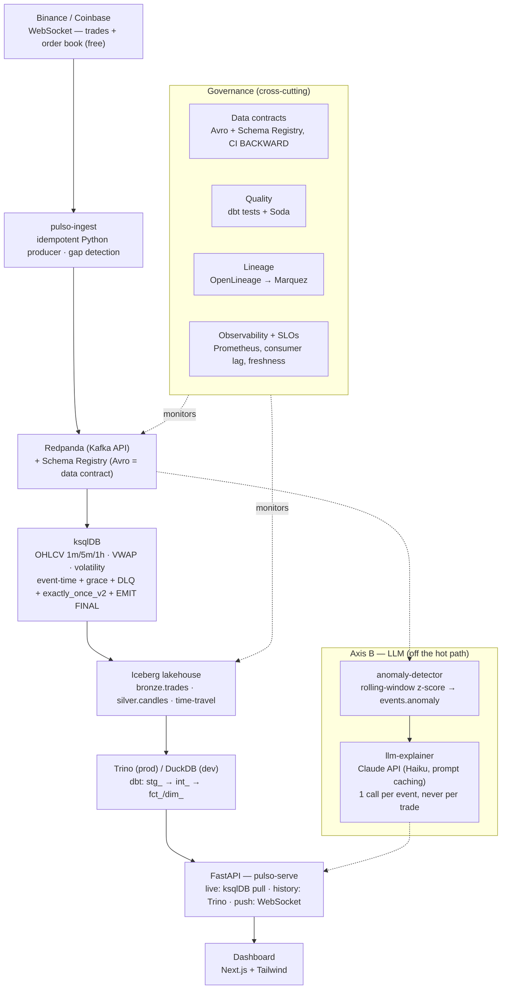

# Pulso

> 🌐 **English** · [Português](README.pt.md)

> A platform that tracks the crypto market **in real time**. It captures every trade as it happens, turns that flow into reliable information, and explains in plain language the moments when the market moves outside its normal range.

[]() []() []() []() []() []() []()

---

## The idea, in plain language

Every second, thousands of people buy and sell Bitcoin, Ethereum, and other digital coins on exchanges around the world. That activity produces a continuous stream of information that is too fast for any person to follow by eye.

**Pulso** plugs into that river. It:

1. **Listens** to every trade the instant it happens, straight from the exchanges (Binance and Coinbase).
2. **Organizes** that volume into useful summaries, such as the open, close, high, and low price of each minute (the "candles" of financial charts).
3. **Stores** everything safely and auditably, so you can travel back in time and revisit exactly how the market looked at any past moment.
4. **Shows** the result on a live dashboard that updates itself as the market moves.
5. **Warns and explains** when something unusual happens, such as a price jump or a volume spike, using AI to write a few sentences on what happened and the likely context.

The result is a control room for the crypto market: you open the dashboard and see the current state of the market in real time.

---

## What value it delivers

| For whom | What they get |
|---|---|
| **Analyst / trader** | Live candles and indicators without depending on a third-party terminal, plus the ability to backtest a strategy against *exact* historical data. |
| **Data team** | A complete reference for a streaming pipeline where data is not lost or duplicated and can always be reprocessed. |
| **Decision maker** | Alerts explained in natural language: instead of "volume z-score 4.2," you read "SOL's volume tripled over the last 3 minutes, possibly linked to [news]." |
| **Cost** | Runs 100% on your own machine for free in development; in the cloud it operates for about **US$ 40/month**. |

### What makes Pulso different from "just another crypto dashboard"

Many tutorials simply take a price and draw a chart. Pulso was built to handle the harder problems that appear with production data:

- **No trade is counted twice or lost.** Even if the connection drops or the system restarts, the final number stays the same (technically, exactly-once).
- **Out-of-order data is handled.** Trades that arrive late are not silently ignored; they are identified and processed separately.
- **History can be replayed.** Any analysis can be re-run against the exact snapshot of the data from a past date.
- **Failures are visible.** Delays and faults are surfaced as alerts rather than discovered later.

---

## How it works, step by step

```
   The exchanges (Binance, Coinbase)
   stream every trade live
              │
              ▼
   [1] CAPTURE       → a "listener" connects and receives each trade
              │
              ▼
   [2] SAFE QUEUE    → everything enters an ordered, loss-proof conveyor
              │
              ▼
   [3] LIVE SUMMARY  → the raw flow becomes candles (1min, 5min, 1h),
                        volume, and volatility, at the right moment
              │
              ▼
   [4] ARCHIVE       → everything is written to a "data lake" that allows
                        time-travel and auditing
              │
              ▼
   [5] DASHBOARD + AI → live charts on screen + AI-explained alerts
```

Each stage is designed so that, if the previous one fails and recovers, no data is lost or duplicated.

---

## The technical part

From here on, the focus is on how this was built and the engineering decisions behind it.

### In one line

A streaming-first data pipeline that consumes trades and order book from crypto exchanges over WebSocket, aggregates OHLCV candles by **event time** with formal correctness (exactly-once, watermarks, late data routed to a DLQ), materializes an auditable Iceberg lakehouse with time-travel, and serves it through an API and live dashboard. A governance layer (data contracts, lineage, quality, SLOs) and an LLM explainer for anomalies sit alongside the pipeline.

> It is the streaming counterpart to [Mapear-RN](https://github.com/Mapear-Data/Mapear-RN), which covers the batch side of the portfolio.

### Architecture



### The 4 correctness pillars

| Pillar | How it's guaranteed |
|---|---|
| **Exactly-once** | Idempotent producer + ksqlDB `exactly_once_v2` + idempotent Iceberg sink (MERGE on `trade_id`). |
| **Correctness under out-of-order data** | Candles close by watermark/grace; late trades go to a DLQ (`*.dlq`) and can be reprocessed. Grace is calibrated from the measured p99 skew. |
| **Reproducibility** | Backtests run against the *exact* state of a given date via **Iceberg time-travel**. |
| **Gap resilience** | Reconnect + circuit breaker + **sequence-gap detection** (`update_id`) on the order book. |

### Key engineering decisions (the "why")

| Decision | Why this one, and not the alternative |
|---|---|
| **ksqlDB** over Flink | The workload is windowed aggregation (OHLCV), not an arbitrary stateful DAG. ksqlDB provides windowing with grace in SQL and `exactly_once_v2` out of the box, with much less operational overhead than a Flink cluster. The trade-off is less flexibility for complex event processing; if the workload outgrows SQL, Flink is the migration target. |
| **Apache Iceberg** over Delta/Hudi/plain Parquet | An open, multi-engine table format: the same tables are read by Trino, DuckDB, and PyIceberg without copying. Snapshots and time-travel make backtests reproducible, and it adds schema evolution, hidden partitioning, and no vendor lock-in. MERGE on the business key gives the idempotent sink. |
| **Avro + Schema Registry** over free-form JSON | The schema is a git-versioned contract with BACKWARD compatibility enforced in CI, which prevents silent drift between producers and consumers. No message reaches the bus without a registered schema. |
| **Redpanda** over Apache Kafka (dev) | Single binary, no ZooKeeper/KRaft to operate, embedded Schema Registry. Kafka-API compatible, so prod can swap to MSK/Confluent with no code change. |
| **Kappa architecture** over Lambda | A single stream code path serves both real time and reprocessing, using log replay and Iceberg time-travel instead of a parallel batch layer. |
| **LLM off the hot path** | Anomaly detection is deterministic (rolling-window z-score). The LLM only explains events that are already sealed, with one call per event and prompt caching, so it stays off the data path and its cost is bounded. |

### Design targets & capacity

> ℹ️ **Design targets / architectural capacity.** These describe what the system was built to guarantee, not benchmarks measured in production.

| Dimension | Design target |
|---|---|
| **Correctness** | 0 duplicates and 0 loss by construction (idempotent producer + `exactly_once_v2` + MERGE sink). |
| **Late-data tolerance (window grace)** | Calibrated per interval from the measured p99 skew — `m1 = 10 s`, `m5 = 30 s`, `h1 = 60 s` ([`ksqldb/10_candles.sql`](ksqldb/10_candles.sql)). Each candle is sealed and emitted once via `EMIT FINAL`. |
| **Freshness / latency SLOs** | `bronze.trades` < 60 s behind event-time · end-to-end (event-time → served candle) < 5 s · API p99 < 2 s · consumer lag < 10 k records/partition — codified in [`governance/slo.yml`](governance/slo.yml), alerted via [`governance/prometheus_rules.yml`](governance/prometheus_rules.yml). |
| **Horizontal scale** | Partitioned by canonical symbol (partition key); throughput scales by adding partitions/brokers. In dev, a single Redpanda broker handles the public trade stream of the seeded pairs. |
| **Cloud cost** | ~US$ 40/month on GCP (5 Cloud Run services, GCS, Cloud SQL) — see [`infra/COST_ANALYSIS.md`](infra/COST_ANALYSIS.md). |
| **LLM cost** | Bounded to one Claude call per anomaly event (not per trade), with prompt caching on the system prompt. |

### Stack

| Layer | Technology | Why |
|---|---|---|
| Bus | **Redpanda** (Kafka API) | Single binary, zero cost locally, embedded Schema Registry. |
| Contracts | **Avro + Schema Registry** | Schema = git-versioned contract; BACKWARD compat in CI. |
| Ingestion | **Python** (websockets, confluent-kafka) | Idempotent producer; gap detection. |
| Stream | **ksqlDB** (on Kafka Streams) | Windowing + grace in SQL; `exactly_once_v2`. |
| Lakehouse | **Apache Iceberg** (MinIO/GCS) | ACID, time-travel, schema evolution, multi-engine. |
| Query | **Trino** + **DuckDB** | History (BI) and local dev over the same data. |
| Transformation | **dbt** | marts + tests; two targets (Trino/DuckDB). |
| Serving | **FastAPI** + **Next.js/Tailwind/TS** | Live + historical candles; market storytelling. |
| Governance | **OpenLineage/Marquez, Soda, Prometheus** | Lineage, quality, observability, SLOs. |
| LLM | **Claude API (Haiku, prompt caching)** | Anomaly explainer, 1 call/event. |
| Infra | **docker-compose** (dev) · **Terraform/GCP** (prod) | Zero-cost local; cloud ~US$40/month. |

### Status — project complete

All milestones delivered. A milestone counts as done when it runs in docker-compose, has tests, and has its corresponding observability item.

| Milestone | Scope | Status |
|---|---|---|
| **0 — Foundation** | uv workspace, docker-compose, Avro contracts, CI compat check, symbol seed | ✅ |
| **1 — Ingestion** | idempotent WebSocket producer, gap detection, Prometheus metrics | ✅ |
| **2 — Stream processing** | ksqlDB OHLCV/VWAP/volatility, event-time, grace + DLQ, exactly-once, pull queries | ✅ |
| **3 — Lakehouse** | idempotent sink → Iceberg bronze/silver, partitioning, time-travel | ✅ |
| **4 — Modeling & serving** | dbt marts, FastAPI, dashboard | ✅ |
| **5 — Governance** | data contracts, Soda, lineage (Marquez), observability, SLOs | ✅ |
| **6 — Reprocessing (Kappa)** | replay, backfill, reproducible backtest, runbook | ✅ |
| **7 — Axis B (LLM)** | anomaly detector + explainer (1 call/event) | ✅ |
| **8 — Cloud (GCP)** | Terraform, GCS, Cloud Run, Cloud SQL, cost analysis | ✅ |

### Running it locally

**Prerequisites:** Docker + docker-compose, [`uv`](https://docs.astral.sh/uv/), `make`.

```bash
make up                 # brings up Redpanda + ksqlDB + MinIO + Trino + Marquez + Postgres
make install            # installs the uv workspace (one .venv for everything)
make check              # lint + tests + contract validation (offline)
make schema-check       # validates Avro compatibility against the live Schema Registry

# Ingestion — WebSocket producer → Kafka (idempotent)
uv run python -m pulso_ingest                    # Binance + Coinbase
uv run python -m pulso_ingest --exchange binance # a single exchange

# Stream processing — ksqlDB (OHLCV candles, volatility, DLQ)
make ksql-test          # offline topology tests (ksql-test-runner)
make ksql-apply         # applies ksqldb/*.sql to the stack (after `make up`)

# Lakehouse — idempotent sink Kafka → Iceberg (bronze/silver)
make sink               # consumes trades.raw + candles.* → Iceberg (idempotent MERGE)
make iceberg-maintain   # maintenance: expire_snapshots

# Serving — dbt marts + API + dashboard
make dbt-build          # dbt marts (DuckDB in dev)
make serve              # FastAPI :8000 (history, live, WebSocket push) + dashboard

# Governance and reprocessing
make soda-check         # quality checks (OHLC invariant, minute gap, volume)
make freshness-check    # freshness SLO (exit 1 if violated)
make replay             # Kappa reprocessing (log replay)
make backtest           # reproducible analysis via Iceberg time-travel

# Axis B — LLM (requires PULSO_ANTHROPIC_API_KEY)
make anomaly-detector   # detects PRICE/VOLUME/VOLATILITY_SPIKE → events.anomaly
make llm-explainer      # explains anomalies via Claude API → DuckDB → API
```

**Local UIs and metrics:** Redpanda Console `:8080` · MinIO `:9001` · Trino `:8085` · ksqlDB `:8088` · API/dashboard `:8000` · Marquez `:3000` (`make up-lineage`). Prometheus metrics: producer `:8001`, sink `:8002`, anomaly-detector `:8003`, llm-explainer `:8004`.

Per-component details: stream processing in [`ksqldb/README.md`](ksqldb/README.md); lakehouse (exactly-once, partitioning, time-travel) in [`libs/pulso-storage/README.md`](libs/pulso-storage/README.md); reprocessing and rollback in [`RUNBOOK_KAPPA.md`](RUNBOOK_KAPPA.md); cloud in [`infra/terraform/README.md`](infra/terraform/README.md) and costs in [`infra/COST_ANALYSIS.md`](infra/COST_ANALYSIS.md).

### Repository structure

```
Pulso/
├── contracts/        # versioned .avsc (data contracts) + compat check
├── libs/
│   ├── pulso-domain/   # symbols, exchanges, seed CSV (source of truth)
│   ├── pulso-infra/    # config, logging, retry, circuit breaker, metrics
│   ├── pulso-ingest/   # WebSocket clients, idempotent producer, gap detection
│   ├── pulso-storage/  # Iceberg writers, dedup/MERGE, time-travel, replay
│   └── pulso-serve/    # API, anomaly store
├── ksqldb/           # versioned .sql queries (candles, volatility)
├── dbt/              # staging → intermediate → marts
├── apps/dashboard/   # FastAPI + Next.js/Tailwind
├── governance/       # Soda, OpenLineage, SLOs + Prometheus rules
├── services/         # freshness-emitter, kappa_replay, backtest, anomaly-detector, llm-explainer
├── infra/            # Terraform GCP
├── tools/            # check_schema_compat.py
├── .github/workflows/
└── docker-compose.yml
```

---

## License

MIT.
